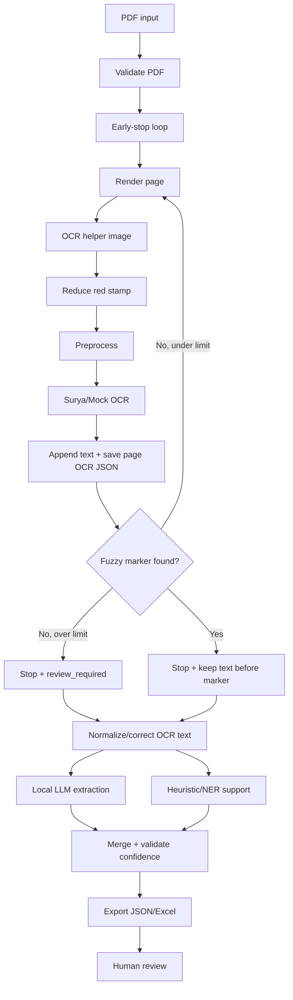

# Workflow OCR early-stop

Pipeline không OCR toàn bộ PDF theo mặc định. Mỗi file được render và OCR từng trang từ đầu tài liệu cho tới khi tìm thấy marker `NỘI DUNG VỤ ÁN` hoặc vượt `MAX_PAGES_BEFORE_CONTENT_MARKER`.

Nhánh triển khai:

- Ezycloudx full-runtime: CLI, FastAPI hoặc Streamlit chạy trực tiếp trên Ezycloudx để máy local không xử lý OCR/model nặng.
- Ezycloudx remote worker: local UI/API điều khiển workflow; Ezycloudx chỉ chạy `/ocr-page`, `/extract`, `/cleanup` qua SSH tunnel hoặc endpoint riêng có token.
- Jupyter chỉ là công cụ debug tùy chọn, không phải workflow chính.

Mermaid nguồn nằm ở `docs/workflow.mmd`.
