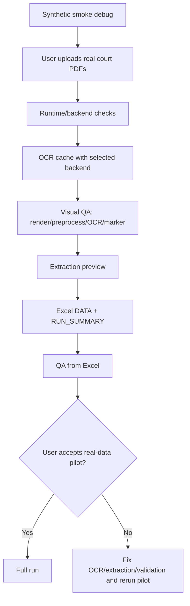

# Workflow

```mermaid
flowchart TD
    S["Synthetic smoke debug"] --> A["User uploads real court PDFs"]
    A --> B["Runtime/backend checks"]
    B --> C["OCR cache with selected backend"]
    C --> D["Visual QA: render/preprocess/OCR/marker"]
    D --> E["Extraction preview"]
    E --> F["Excel DATA + RUN_SUMMARY"]
    F --> G["QA from Excel"]
    G --> H{"User accepts real-data pilot?"}
    H -->|Yes| I["Full run"]
    H -->|No| J["Fix OCR/extraction/validation and rerun pilot"]
```

Do not use fake data to judge quality. Unit tests only protect code contracts.
Synthetic smoke only proves that debug artifacts can be generated from non-real fixtures.
